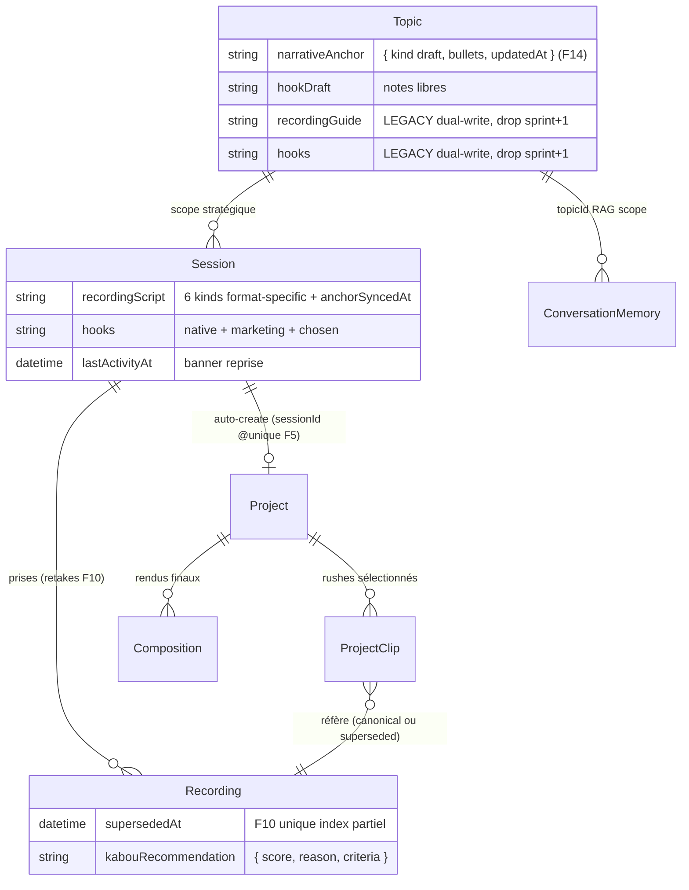
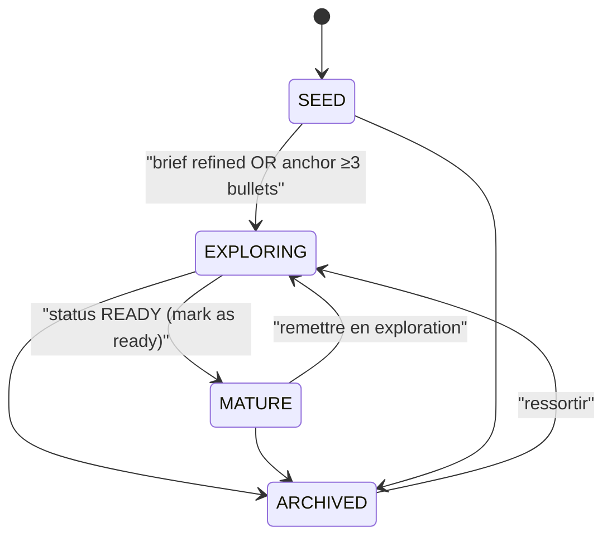
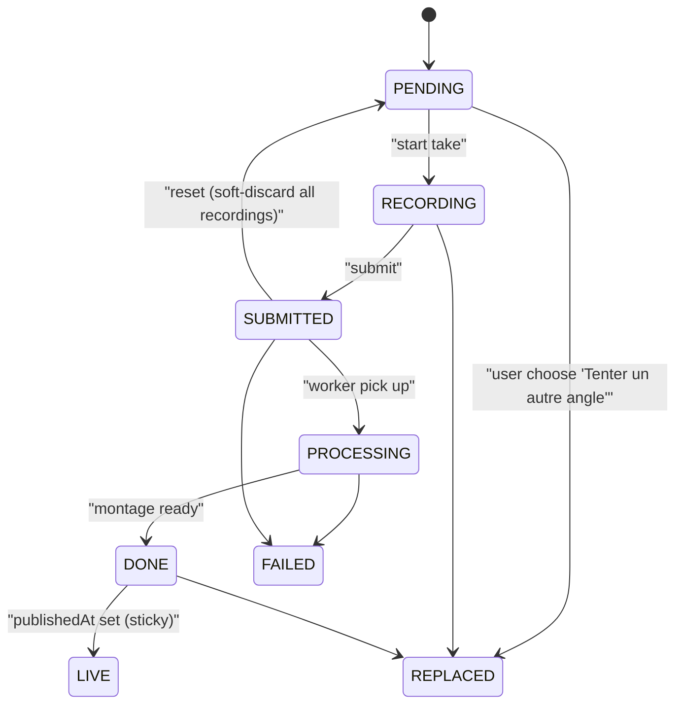

# Subject → Session → Recording → Project — architecture 2 axes

**Mise à jour :** 2026-04-22
**Origine :** party mode BMAD 2026-04-21 — 8 décisions + 3 extensions actées, spec consumé : [`_bmad-output/quick-specs/subject-session-refactor.md`](../../_bmad-output/quick-specs/subject-session-refactor.md)

---

## Philosophie 2 axes orthogonaux

Le modèle précédent confondait stratégie et tactique : les états `SCHEDULED` et `PRODUCING` polluaient l'enum `CreativeState` du Topic alors qu'ils appartiennent à une Session ; `Topic.recordingGuide` écrasait les format-specific variants à chaque reshape ; la publication s'accrochait à une Session précise alors qu'un Project agrège des rushes multi-sessions. La refonte sépare deux axes qui ne s'intersectent plus :

```
🌱 Axe Topic (maturité de l'idée — stratégique, long-terme)
    SEED → EXPLORING → MATURE → ARCHIVED
    Graine · Jeune pousse · Arbre · Archivé

🎬 Axe Session (cycle de vie d'UN tournage — tactique, format-specific)
    PENDING → RECORDING → SUBMITTED → PROCESSING → DONE → LIVE
              + FAILED, REPLACED
```

- **Topic** = mémoire stratégique long-terme : intention, angle narratif (`narrativeAnchor`), sources, thread Kabou, notes libres d'accroches (`hookDraft`). Test : *"Je reviens dans 3 mois, je veux retrouver ça."*
- **Session** = performance tactique d'un tournage : script format-specific (`recordingScript`), hooks engagés (`hooks`), recovery state. Dure de l'idée au publish.
- **Recording** = trace physique d'une prise : video brute, transcript, word timestamps. Éphémère sauf si publiée.
- **Project** = assembly créatif : le montage, qui peut agréger des rushes de 1 ou N sessions d'un même Topic.
- **Composition** = rendu final vidéo (artefact Remotion).
- **Publier** = rituel de diffusion — n'est pas un artefact, c'est une étape de cycle. Vit désormais sur Project.

---

## Diagramme entités



---

## State machines (side-by-side)

### Topic — 4 états stratégiques



Implémenté par `deriveCreativeState(input)` dans [`apps/web/src/lib/creative-state.ts`](../../apps/web/src/lib/creative-state.ts).

### Session — 7 états tactiques



Notes :
- `REPLACED` (pas `ARCHIVED`) pour éviter la collision avec `Topic.ARCHIVED` (règle 2 axes orthogonaux).
- Un index unique partiel DB (F4) garantit au plus UNE session canonique par `(topicId, contentFormat)` parmi les statuts non-REPLACED/FAILED.
- Un second index unique partiel (F10) garantit au plus UN Recording canonique par `(sessionId, questionId)` quand `supersededAt IS NULL`.

---

## Matrix — quelle donnée vit à quel niveau

| Artefact | Topic | Session | Recording | Project | Composition |
| --- | --- | --- | --- | --- | --- |
| Nom / intention | ✅ | — | — | (hérite) | — |
| Brief / angle | ✅ | — | — | — | — |
| narrativeAnchor (draft bullets) | ✅ | — | — | — | — |
| recordingScript (format-specific) | — | ✅ | — | — | — |
| hookDraft (notes libres) | ✅ | — | — | — | — |
| hooks (native / marketing) | — | ✅ (format-specific) | — | — | — |
| Sources factuelles | ✅ | — | — | — | — |
| Thread Kabou | ✅ (partagé) | — | — | — | — |
| Recording (video brute, transcript) | — | — | ✅ | — | — |
| supersededAt (retake canonical) | — | — | ✅ | — | — |
| kabouRecommendation (⭐) | — | — | ✅ | — | — |
| lastActivityAt (reprise) | — | ✅ | — | — | — |
| RecordingAnalysis (résumé, forces, pistes) | — | ✅ | — | — | — |
| ProjectClip (sélection montage) | — | — | — | ✅ | — |
| montageSettings | — | (legacy) | — | ✅ | — |
| finalVideoKey | — | (legacy) | — | — | ✅ |
| publishedAt | — | ✅ (source de LIVE) | — | — | — |
| Publier (ritual) | — | (signale) | — | ✅ (URL) | — |

---

## Legacy tool aliases — phase-out plan

Pendant 1 sprint, les anciens noms de tools Kabou cohabitent avec les nouveaux pour ne pas casser les threads qui référencent encore les anciennes clés. Implémenté dans [`apps/web/src/app/api/chat/route.ts`](../../apps/web/src/app/api/chat/route.ts).

| Nouveau (source de vérité) | Alias legacy (dual-write) | Drop target |
| --- | --- | --- |
| `update_narrative_anchor` (écrit `Topic.narrativeAnchor` + `Topic.recordingGuide`) | `update_recording_guide_draft` | sprint+1 |
| `reshape_to_recording_script` (écrit `Session.recordingScript`) | `reshape_recording_guide_to_format` (fallback Topic si pas de sessionId) | sprint+1 |

De même au niveau DB, les colonnes `Topic.recordingGuide` et `Topic.hooks` (legacy) coexistent avec `Topic.narrativeAnchor` et `Topic.hookDraft` (nouveau). La migration sprint+1 les droppera après validation du dual-write stable.

---

## Rollout plan (F16)

1. **Pre-deploy check** — en heure creuse (week-end / nuit) :
   ```sql
   -- Sessions actives depuis <1h : si > 0, reporter le deploy
   SELECT COUNT(*) FROM "Session"
   WHERE "status" IN ('RECORDING', 'PENDING')
     AND "updatedAt" > NOW() - INTERVAL '1 hour';
   ```
2. **Pre-migration duplicate checks** (F4, F5) — les index uniques partiels échouent si des duplicates existent :
   ```sql
   -- F5 : Project.sessionId duplicates
   SELECT "sessionId", count(*) FROM "Project"
   WHERE "sessionId" IS NOT NULL
   GROUP BY "sessionId" HAVING count(*) > 1;

   -- F4 : Session canonical per (topicId, contentFormat) duplicates
   SELECT "topicId", "contentFormat", count(*) FROM "Session"
   WHERE "status" NOT IN ('REPLACED', 'FAILED')
     AND "topicId" IS NOT NULL
     AND "contentFormat" IS NOT NULL
   GROUP BY "topicId", "contentFormat" HAVING count(*) > 1;
   ```
   Si `> 0 ligne`, dedup manuel (garder le plus ancien, orphan les autres) avant d'appliquer la migration.
3. **Apply** : `prisma migrate deploy` applique les 2 migrations séquentiellement (`add_session_status_values` d'abord — ALTER TYPE — puis `subject_session_refactor` — colonnes + index + backfills).
4. **Post-deploy monitoring** :
   ```sql
   -- Sessions "stuck" RECORDING > 30min après le deploy
   SELECT id, "updatedAt" FROM "Session"
   WHERE "status" = 'RECORDING'
     AND "updatedAt" < NOW() - INTERVAL '30 minutes';
   ```
5. **Validation dual-write** : 24h d'observation que le chat route écrit bien dans les deux colonnes via `update_narrative_anchor` (grep logs applicatifs).

---

## Rollback procedure

Les 2 migrations sont construites pour que la migration 2 soit rollback-safe sans impacter la migration 1 (les nouveaux littéraux d'enum `LIVE`/`REPLACED` peuvent rester — ils ne sont pas utilisés par le code rollback).

**Rollback sans perte de data** :
1. Revert le code de ce sprint (checkout commit pré-Phase 1).
2. `prisma migrate resolve --rolled-back <nom_migration_2>` (Prisma 5.3+) puis appliquer manuellement une migration inverse qui :
   - Drop les colonnes new (`Topic.narrativeAnchor`, `Topic.hookDraft`, `Session.recordingScript`, `Session.hooks`, `Session.lastActivityAt`, `Recording.supersededAt`, `Recording.kabouRecommendation`, `ConversationMemory.topicId`).
   - Drop les deux index uniques partiels (`Session_topicId_contentFormat_canonical_unique`, `Recording_sessionId_questionId_canonical_unique`).
   - Drop la contrainte `Project_sessionId_key`.
3. Les legacy columns (`Topic.recordingGuide`, `Topic.hooks`) n'étaient jamais touchées par le rollout — elles portent les données sans perte.
4. Les tools Kabou legacy continuent de fonctionner (aliases dual-write).

---

## Test plan consolidé

Clean slate — aucun framework de test configuré (ni vitest, ni jest, ni playwright dans `package.json` web/api). Le plan est manuel, en Given/When/Then. Si E2E automatisé souhaité post-spec : invoker `/bmad-testarch-framework` séparément (Playwright recommandé).

### Scenarios end-to-end (user journey)

1. **Seed → Mature → Record** : créer un Topic, discuter avec Kabou jusqu'à avoir 3+ bullets d'angle (état EXPLORING), marquer ready (MATURE), cliquer "Nouveau tournage HOT_TAKE" → session PENDING créée, script format-specific généré. → Vérifier `Session.recordingScript.kind === 'hot_take'` + `anchorSyncedAt` set.
2. **Retake canonical atomic (F10)** : depuis une session RECORDING, enregistrer Q1, puis Q1 à nouveau (retake). → Vérifier en base : 2 Recordings sur (sessionId, Q1.id), le premier a `supersededAt` set, le second `supersededAt NULL`. Simuler 2 confirmRecording concurrents → la 2e insertion DB doit échouer (unique index partiel F10).
3. **Trio reset/variante** : sur écran post-tournage, cliquer "🔄 On reprend à zéro" + confirm → `Session.status = PENDING`, tous les recordings `supersededAt` set. Cliquer "🎨 Tenter un autre angle" → session courante REPLACED + nouvelle session même (topicId, contentFormat) créée + `recordingScript` cloné + redirection `/s/[newId]`.
4. **Recovery <1h / <1 semaine / >1 semaine** : ouvrir `/s/[sessionId]` à chaud (moins d'une heure) → banner "on reprend à Q{X}". Attendre +24h (ou modifier `lastActivityAt` DB) → wording `<1 semaine`. +30 jours → wording long-terme + mention "ton angle a peut-être évolué" si `Topic.narrativeAnchor.updatedAt > Session.recordingScript.anchorSyncedAt`.
5. **Publier via Project** : submit une session → Project auto-créé via `sessionId @unique` (upsert F5). Cliquer "Publier" depuis SubjectWorkspace → redirection directe `/projects/[projectId]/publier`. Ancien path `/sujets/[sessionId]/publier` → 301 via page redirect.
6. **Take selector ⭐** : session avec 2 retakes sur Q1, submit → `take-analysis.service` appelé post-submit → `Recording.kabouRecommendation` posé sur le canonical. ProjectDetail affiche badge ⭐ + accordion "Prises précédentes (1)".

### Acceptance Criteria (résumé par Story)

Référence complète dans [`_bmad-output/quick-specs/subject-session-refactor.md`](../../_bmad-output/quick-specs/subject-session-refactor.md). Résumé :

- **Story 1 (Migration)** : AC 1.1–1.8 — colonnes, backfill, enum, uniqueness (F1, F4, F5, F6).
- **Story 2 (Services + RAG)** : AC 2.1–2.5 — hooks format-aware, RAG topicId scope, preflight 404.
- **Story 3 (UX Sujet)** : AC 3.1–3.8 — 4 états timeline, cartes format, hero MATURE, F7 grep vérifiable.
- **Story 4 (UI Session)** : AC 4.1–4.5 — NarrativeAnchorSticky visible recording, stale badge.
- **Story 5 (Trio + soft-discard)** : AC 5.1–5.5, 5.3-bis (F10 atomic) — reset idempotent, replace crée variante, retake atomique.
- **Story 6 (Kill preflight)** : AC 6.1–6.3 — 0 résultat grep `SubjectPreflight|preflight.service` côté code.
- **Story 7 (Recovery)** : AC 7.1–7.6 — banner 3 wordings, retry upload silent, cross-device warning.
- **Story 8 (Doc + wording)** : AC 8.1–8.3 — ce document + grep `KABOU_VOCABULARY` pour F17 ("Échec" → "Raté" uniquement dans la table de traduction).
- **Story 9 (Take selector)** : AC 9.1–9.4 — group questionId, badge ⭐ tooltip, accordion variantes, drag superseded OK.
- **Story 10 (take-analysis)** : AC 10.1–10.4 — canonical choisie + reason spécifique, noop si 1 prise, graceful LLM error.
- **Story 11 (Publier migration)** : AC 11.1–11.6 — auto-create idempotent, redirect legacy, `Publier` link via Project.

---

## Out of scope (V2+)

- Warm-up caméra pré-tournage avec analyse ton live.
- UI take selector avec sélection canonique post-hoc (V1.5 = recommandation auto uniquement).
- Policy de cleanup auto des recordings `supersededAt > 90 jours`.
- Détection cross-topic automatique dans un Project (user qui mixe 2 topics) — V1 = message informatif si besoin, pas de logique dédiée.
- Thread Kabou par Session (V1 garde thread partagé Topic + context injection F12).
- Propagation auto de `narrativeAnchor` vers les Sessions existantes.
- Full scroll-through timeline editing dans Project (drag-and-drop simple pour V1).
- Chunked upload live pendant le recording (V1 = IndexedDB buffer + upload au take-complete).
- Table `UserEvent` analytics (F20) — V1 utilise `console.info` ultra-lite.
- Agrégation LinkedIn multi-session dans PublishView (F13 partiel — V1 reste session-scoped, follow-up tech-spec séparé).
